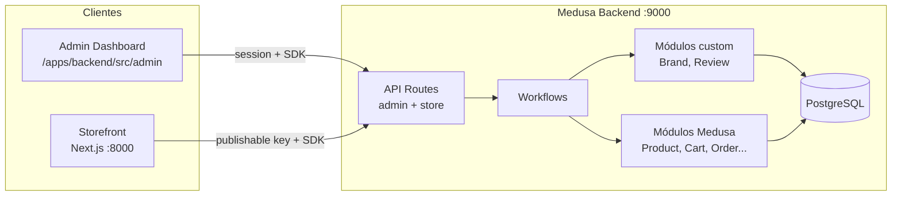

# Arquitectura

## Vista general

## Principio de capas (Medusa)

Toda funcionalidad de negocio nueva debe seguir:

1. **Módulo** — Define el modelo de datos y el servicio (`MedusaService`). Es la única capa que persiste entidades propias del dominio.
2. **Module link** — Relaciona entidades de módulos distintos sin acoplar servicios (ej. `product` ↔ `brand`).
3. **Workflow** — Orquesta mutaciones, compensación (rollback) y uso de servicios/links.
4. **API route** — Expone HTTP, valida entrada (Zod + middlewares) y ejecuta workflows o consultas.
5. **Cliente** — Admin (`sdk` con sesión) o Storefront (`@medusajs/js-sdk` con publishable key).

### Qué no hacer

- Llamar `brandModuleService.createBrands()` desde una ruta sin workflow.
- Usar `PUT`/`PATCH` en rutas custom.
- Consultar tablas de otro módulo con SQL directo; usar `query.graph` o links.
- Poner reglas de negocio complejas solo en el componente React del admin.

## Monorepo

| Paquete | Responsabilidad |
|---------|-----------------|
| `@dtc/backend` | API REST, workflows, módulos, admin Vite embebido |
| `@dtc/storefront` | UI pública, checkout, cuenta cliente |

`pnpm-workspace.yaml` incluye `apps/**` y excluye `apps/backend/.medusa/**`.

Turbo coordina `build`, `dev`, `lint`, `test` y `seed` sin imponer dependencias entre apps más allá de la configuración en `turbo.json`.

## Autenticación

| Superficie | Mecanismo |
|------------|-----------|
| Admin API | Sesión (cookies); SDK admin con `auth: { type: "session" }` |
| Store API | Publishable API key + contexto de región/carrito |
| Storefront | Server actions / `lib/data/*` usando SDK con publishable key |

## Datos y consultas

- **Dentro del mismo módulo**: servicio del módulo (`listBrands`, `retrieveBrand`, …).
- **Lectura con relaciones**: `req.scope.resolve("query").graph({ entity, fields, ... })`.
- **Filtros entre módulos enlazados**: Index Module (`query.index`) cuando se necesite filtrar por campos de módulos linkados.

## Extensión del core de Medusa

El proyecto usa **workflow hooks** para enganchar flujos del core sin modificarlos. Ejemplo: al crear y actualizar productos (`createProductsWorkflow` / `updateProductsWorkflow`), se enlaza/reasigna `brand_id` desde `additional_data` ([brands.md](./custom-features/brands.md)).

## Referencia de diseño (storefront)

`apps/storefront/design-reference/` contiene prototipos HTML/JSX (p. ej. “Rodi Mercado”) como referencia visual; no es código de producción del App Router.

## Recursos

- Skills del repo: `.agents/skills/building-with-medusa/`
- [Medusa — Commerce Modules](https://docs.medusajs.com/resources/commerce-modules)
- [Medusa — Workflows](https://docs.medusajs.com/resources/medusa-workflows)
