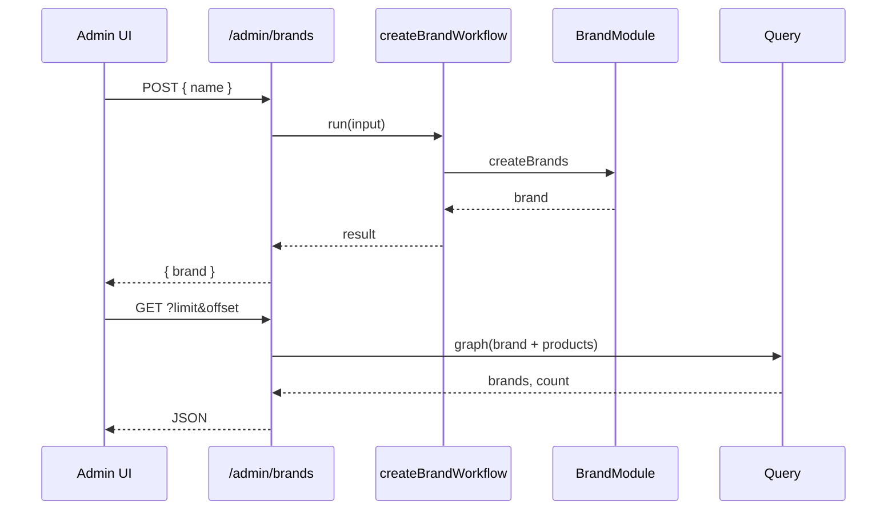

# Feature: Brands (Marcas)

Implementación de referencia del patrón Medusa **Module → Workflow → API → Admin**, con enlace a productos del core.

## Modelo de dominio

Entidad `brand`:

| Campo | Tipo | Notas |
|-------|------|-------|
| `id` | string (PK) | Generado por Medusa |
| `name` | text | Nombre visible |

Archivo: `apps/backend/src/modules/brand/models/brand.ts`

Relación con productos: **muchos productos → una marca** (desde el lado producto, `brand` es singular; desde marca, lista de productos).

## Componentes

### 1. Módulo Brand

| Archivo | Propósito |
|---------|-----------|
| `modules/brand/index.ts` | Registro `BRAND_MODULE = "brand"` |
| `modules/brand/service.ts` | `MedusaService({ Brand })` — CRUD auto-generado |
| `modules/brand/migrations/` | Schema DB |

Registrado en `medusa-config.ts`:

```typescript
modules: [{ resolve: "./src/modules/brand" }]
```

### 2. Module link

`links/product-brand.ts`:

- `ProductModule.linkable.product` (`isList: true`)
- `BrandModule.linkable.brand`

Permite consultas como `fields: ["id", "name", "products.*"]` en brands o `+brand.*` en productos.

### 3. Workflow create-brand

```
workflows/create-brand.ts          → orquestación
workflows/steps/create-brand.ts    → createBrands + deleteBrands en compensación
```

Entrada: `{ name: string }`. Salida: entidad brand creada.

### 4. API Admin

**`GET /admin/brands`**

- Query: paginación estándar Medusa (`limit`, `offset`, …)
- Middleware: `GetBrandsSchema` + fields default `id`, `name`, `products.*`
- Implementación: `query.graph({ entity: "brand", ...req.queryConfig })`
- Respuesta: `{ brands, count, limit, offset }`

**`POST /admin/brands`**

- Body: `{ name: string }` (Zod: `PostAdminCreateBrand`)
- Ejecuta `createBrandWorkflow`
- Respuesta: `{ brand }`

Archivos:

- `api/admin/brands/route.ts`
- `api/admin/brands/validators.ts`
- Reglas en `api/middlewares.ts`

### 5. Asociar marca al crear producto

**Middleware** en `POST /admin/products`:

```typescript
additionalDataValidator: {
  brand_id: z.string().optional()
}
```

**Hook** `workflows/hooks/created-product.ts` en `createProductsWorkflow.hooks.productsCreated`:

1. Si no hay `additional_data.brand_id`, no hace nada
2. Verifica que la marca existe (`retrieveBrand`)
3. Crea links `{ product_id, brand_id }` para cada producto creado
4. Rollback: `link.dismiss(links)`

Ejemplo de creación de producto con marca (API admin):

```json
POST /admin/products
{
  "title": "Camiseta",
  "...": "...",
  "additional_data": {
    "brand_id": "brand_01..."
  }
}
```

### 6. Admin UI

**Página Brands** — `admin/routes/brands/page.tsx`

- Menú lateral: label "Brands", icono `TagSolid`
- Tabla paginada (15 filas) vía `sdk.client.fetch('/admin/brands')`
- Columnas: ID, Name, número de Products

**Widget producto** — `admin/widgets/product-brand.tsx`

- Zona: `product.details.before`
- Muestra nombre de marca con `sdk.admin.product.retrieve(id, { fields: "+brand.*" })`

## Flujo de datos (diagrama)



## Extender Brands

| Necesidad | Dónde actuar |
|-----------|--------------|
| Campos extra (logo, slug) | Modelo + migración + validators + UI |
| Editar / eliminar marca | Workflows update/delete + rutas POST/DELETE |
| API store pública | `api/store/brands/route.ts` + CORS store |
| Filtro por marca en storefront | Store route o `query.graph` con publishable key |
| Seed de marcas | Script en `migration-scripts/` o workflow en seed |

## Archivos (mapa rápido)

```
apps/backend/src/
├── modules/brand/
├── links/product-brand.ts
├── workflows/
│   ├── create-brand.ts
│   ├── steps/create-brand.ts
│   └── hooks/created-product.ts
├── api/admin/brands/
│   ├── route.ts
│   └── validators.ts
├── api/middlewares.ts          # brands + brand_id en products
└── admin/
    ├── routes/brands/page.tsx
    └── widgets/product-brand.tsx
```

## Lecciones del repo

Esta feature sigue el tutorial en `.agents/skills/learning-medusa/lessons/` (módulos, links, admin). Usar esas lecciones y los checkpoints en `.agents/skills/learning-medusa/checkpoints/` para verificar implementaciones similares.
