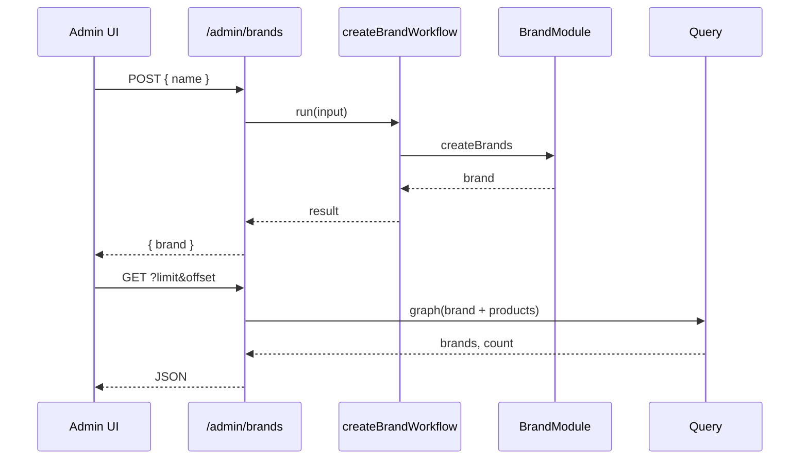

# Feature: Brands (Marcas)

Implementación de referencia del patrón Medusa **Module → Workflow → API → Admin**, con enlace a productos del core.

## Modelo de dominio

Entidad `brand`:

| Campo | Tipo | Notas |
|-------|------|-------|
| `id` | string (PK) | Generado por Medusa |
| `name` | text | Nombre visible |

Archivo: `apps/backend/src/modules/brand/models/brand.ts`

Relación con productos: **muchos productos → una marca** (desde el lado producto, `brand` es singular; desde marca, lista de productos).

## Componentes

### 1. Módulo Brand

| Archivo | Propósito |
|---------|-----------|
| `modules/brand/index.ts` | Registro `BRAND_MODULE = "brand"` |
| `modules/brand/service.ts` | `MedusaService({ Brand })` — CRUD auto-generado |
| `modules/brand/migrations/` | Schema DB |

Registrado en `medusa-config.ts`:

```typescript
modules: [{ resolve: "./src/modules/brand" }]
```

### 2. Module link

`links/product-brand.ts`:

- `ProductModule.linkable.product` (`isList: true`)
- `BrandModule.linkable.brand`

Permite consultas como `fields: ["id", "name", "products.*"]` en brands o `+brand.*` en productos.

### 3. Workflows

```
workflows/create-brand.ts          → orquestación create
workflows/steps/create-brand.ts    → createBrands + deleteBrands en compensación
workflows/update-brand.ts          → orquestación update
workflows/steps/update-brand.ts    → updateBrands + compensación (revierte al nombre previo)
workflows/delete-brand.ts          → orquestación delete
workflows/steps/delete-brand.ts    → removeRemoteLinkStep (limpia links product↔brand) + deleteBrands;
                                       compensación recrea la marca con el mismo id
```

`create`: entrada `{ name: string }`, salida entidad brand creada.
`update`: entrada `{ id: string, name: string }`.
`delete`: entrada `{ id: string }` — antes de borrar, ejecuta `removeRemoteLinkStep({[BRAND_MODULE]: {brand_id: input.id}})` para no dejar links huérfanos en la tabla de module link (mismo patrón que `deleteCollectionsWorkflow` del core). Es **hard delete sin bloqueo** aunque la marca tenga productos asignados — ver "Decisiones clave" abajo.

### 4. API Admin

**`GET /admin/brands`**

- Query: paginación estándar Medusa (`limit`, `offset`, …)
- Middleware: `GetBrandsSchema` + fields default `id`, `name`, `products.*`
- Implementación: `query.graph({ entity: "brand", ...req.queryConfig })`
- Respuesta: `{ brands, count, limit, offset }`

**`POST /admin/brands`**

- Body: `{ name: string }` (Zod: `PostAdminCreateBrand`)
- Ejecuta `createBrandWorkflow`
- Respuesta: `{ brand }`

**`POST /admin/brands/:id`**

- Body: `{ name: string }` (Zod: `PostAdminUpdateBrand`)
- Ejecuta `updateBrandWorkflow`
- Respuesta: `{ brand }`

**`DELETE /admin/brands/:id`**

- Ejecuta `deleteBrandWorkflow`
- Respuesta: `{ id, object: "brand", deleted: true }`

Archivos:

- `api/admin/brands/route.ts` (GET, POST)
- `api/admin/brands/[id]/route.ts` (POST update, DELETE)
- `api/admin/brands/validators.ts` (`PostAdminCreateBrand`, `PostAdminUpdateBrand`)
- Reglas en `api/middlewares.ts`

### 5. API Store (lectura pública)

**`GET /store/brands`** — `api/store/brands/route.ts`

Listado público de solo lectura (misma forma que el GET admin, vía `query.graph` + `req.queryConfig`); pensado para filtro de marca en el PLP o la franja de marcas del home. Ya consumido por el storefront: `lib/data/brands.ts` y `modules/home/components/rodi-brands-strip/`.

### 5.1. Filtrado de productos por marca (Index Module)

Desde Fase 10, `product-brand.ts` marca el lado `brand` del link como `filterable: ["id", "name"]`, y el endpoint `GET /store/products-list` (**no** `/store/products` — ver más abajo por qué) acepta `brand_id` para filtrar el listado de productos por marca. Requiere el módulo `@medusajs/index` (Index Engine) registrado en `medusa-config.ts` y `MEDUSA_FF_INDEX_ENGINE=true` — `query.graph()` no puede filtrar por un campo de un módulo enlazado (brand vive en su propio módulo), solo `query.index()` puede.

**Por qué es un endpoint nuevo y no un override de `/store/products`**: se intentó overridear la ruta core primero y no funcionó — el middleware de validación estricto de core sigue corriendo en paralelo al del proyecto aunque el `route.ts` se reemplace (Medusa reemplaza el *handler* por matcher, pero concatena middlewares en vez de reemplazarlos). Detalle completo, con los tres hallazgos que llevaron al diseño final, en [`.context/plans/2026-07-08/FASE-10-filtro-marca-index-module.md`](../../.context/plans/2026-07-08/FASE-10-filtro-marca-index-module.md).

Consumido por el storefront en `lib/data/products.ts` (`listProducts()`, que ahora apunta a `/store/products-list` para todo el listado, no solo cuando hay `brand_id`) y `modules/store/components/rodi-plp-filters/`.

### 6. Asociar marca a un producto

**Al crear** — middleware en `POST /admin/products`:

```typescript
additionalDataValidator: {
  brand_id: z.string().optional()
}
```

Hook `workflows/hooks/created-product.ts` en `createProductsWorkflow.hooks.productsCreated`:

1. Si no hay `additional_data.brand_id`, no hace nada
2. Verifica que la marca existe (`retrieveBrand`)
3. Crea links `{ product_id, brand_id }` para cada producto creado
4. Rollback: `link.dismiss(links)`

**Al actualizar** (producto ya existente) — middleware en `POST /admin/products/:id`:

```typescript
additionalDataValidator: {
  brand_id: z.string().nullable().optional()
}
```

Hook `workflows/hooks/updated-product.ts` en `updateProductsWorkflow.hooks.productsUpdated`:

- `additional_data.brand_id` ausente (`undefined`) → no hace nada
- viene un id → desvincula el link anterior (si existía) y crea el nuevo (evita duplicar links al reasignar)
- viene `null` → solo desvincula

Ejemplo de creación de producto con marca (API admin):

```json
POST /admin/products
{
  "title": "Camiseta",
  "...": "...",
  "additional_data": {
    "brand_id": "brand_01..."
  }
}
```

### 7. Admin UI

**Página Brands** — `admin/routes/brands/page.tsx`

- Menú lateral: label "Brands", icono `TagSolid`
- Tabla paginada (15 filas) vía `sdk.client.fetch('/admin/brands')`
- Columnas: ID, Name, número de Products
- Botón "Create" → `FocusModal` con input de nombre → `POST /admin/brands`
- Columna de acciones por fila (`columnHelper.action`): Edit (abre `FocusModal` prellenado → `POST /admin/brands/:id`) y Delete en grupo separado como acción destructiva
- Delete usa `usePrompt()` (`variant: "danger"`); si la marca tiene productos asignados, el mensaje lo indica explícitamente antes de confirmar

**Widget producto** — `admin/widgets/product-brand.tsx`

- Zona: `product.details.before`
- Editable: `Select` con la lista de marcas + botón "Guardar" que llama `POST /admin/products/:id` con `additional_data.brand_id` (o `null` para quitar la marca)
- Usa `sdk.client.fetch` genérico en vez de `sdk.admin.product.update` porque `HttpTypes.AdminUpdateProduct` no tipa `additional_data.brand_id`

## Flujo de datos (diagrama)



## Decisiones clave

- **Hard delete + limpieza explícita de links**, no soft-delete ni bloqueo de borrado si la marca tiene productos. El riesgo real no es "borrar con relaciones" sino dejar filas huérfanas en la tabla de link (`product↔brand` es un module link entre módulos aislados, no una FK) — se resuelve con `removeRemoteLinkStep` antes del delete, igual que `deleteCollectionsWorkflow` en core.
- **Asignación de marca vive en el widget del PDP, no en el wizard nativo de creación de producto** — el create-product de Medusa no expone un punto de extensión limpio para campos custom en su payload; el widget de detalle sí, y cubre creación y edición con una sola implementación.
- **Sin unicidad en `name`** — el validator solo exige `z.string()`. Marcas duplicadas son posibles hoy.

## Extender Brands

| Necesidad | Dónde actuar |
|-----------|--------------|
| Campos extra (logo, slug) | Modelo + migración + validators + UI |
| Unicidad de `name` | Validator + constraint en migración |
| Conteo de productos por marca en el filtro del PLP | Agregación adicional en `products-list` — no implementado en Fase 10 |
| Seed de marcas | Script en `migration-scripts/` o workflow en seed |

## Archivos (mapa rápido)

```
apps/backend/src/
├── modules/brand/
├── links/product-brand.ts
├── workflows/
│   ├── create-brand.ts + steps/create-brand.ts
│   ├── update-brand.ts + steps/update-brand.ts
│   ├── delete-brand.ts + steps/delete-brand.ts
│   ├── hooks/created-product.ts
│   └── hooks/updated-product.ts
├── api/admin/brands/
│   ├── route.ts            # GET, POST
│   ├── [id]/route.ts       # POST (update), DELETE
│   └── validators.ts
├── api/store/brands/route.ts   # GET público
├── api/middlewares.ts          # brands + brand_id en products (create y update)
└── admin/
    ├── routes/brands/page.tsx      # tabla + create/edit/delete
    └── widgets/product-brand.tsx   # editable

apps/storefront/src/
├── lib/data/brands.ts
├── lib/util/product-brand.ts
└── modules/home/components/rodi-brands-strip/
```

## Lecciones del repo

Esta feature sigue el tutorial en `.agents/skills/learning-medusa/lessons/` (módulos, links, admin). Usar esas lecciones y los checkpoints en `.agents/skills/learning-medusa/checkpoints/` para verificar implementaciones similares.
