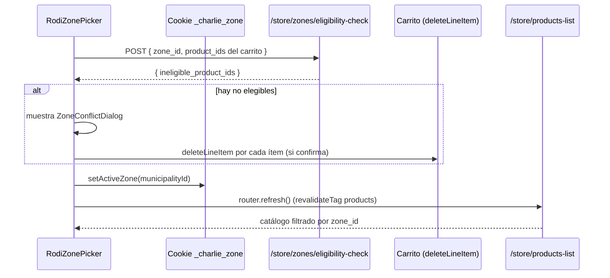

# Feature: Zonas de entrega (Provincia → Municipio)

Módulo custom `zone` que modela la geografía de entrega de Cuba (15 provincias + "Isla de la Juventud" como pseudo-provincia, 168 municipios) y la usa para tres cosas: el selector **"Entregar en"** del storefront, el filtrado de catálogo por disponibilidad de producto, y la entregabilidad del checkout. Sigue el patrón **Module → Link → Workflow → API** del resto del repo, con dos particularidades: es el primer **link N–M** (`isList: true` en ambos lados) y el primer módulo con una **relación intra-módulo** (`Province.hasMany(Municipality)`).

No confundir con el módulo `Region` de Medusa (moneda/impuestos/pago) — la región del proyecto quedó fija en una sola ("Cuba", ver `.context/plan-zonas-entrega-provincia-municipio.md` Fase 0), y `zone` es un concepto ortogonal y propio de este repo.

## Modelo de dominio

Entidad `province`:

| Campo | Tipo | Notas |
|-------|------|-------|
| `id` | string (PK) | Generado por Medusa |
| `name` | text | Nombre visible (ej. "La Habana") |
| `code` | text | Código corto estable, ASCII (ej. `LHA`) — clave de unión usada en todo el módulo (`PROVINCE_ORDER`, `CUBA_PROVINCE_ISO_CODE`, `seed-zones.ts`) |
| `iso_code` | text, nullable | Código ISO 3166-2:CU (ej. `cu-03`), agregado en el Workstream D de cierre (2026-07-23) — ver [`geo-zones-fulfillment.md`](../../.context/geo-zones-fulfillment.md) |
| `municipalities` | hasMany | Relación intra-módulo, `mappedBy: "province"` |

Entidad `municipality` — **la zona operativa** (donde de verdad se linkea disponibilidad de producto, no en `province`):

| Campo | Tipo | Notas |
|-------|------|-------|
| `id` | string (PK) | |
| `name` | text | |
| `code` | text | Formato `{province.code}-{slug}`, ej. `LHA-cerro` |
| `is_active` | boolean, default `true` | Permite desactivar una zona (sin entrega ahí todavía) sin borrarla ni sus links |
| `province` | belongsTo | `mappedBy: "municipalities"` |

Archivos: `apps/backend/src/modules/zone/models/province.ts`, `apps/backend/src/modules/zone/models/municipality.ts`.

Relación con productos: **muchos productos ↔ muchos municipios** (N–M). Un producto sin ningún municipio linkeado está disponible **en todas partes** — fallback permisivo, decisión de negocio del 2026-07-19.

## Componentes

### 1. Módulo Zone

| Archivo | Propósito |
|---------|-----------|
| `modules/zone/index.ts` | Registro `ZONE_MODULE = "zone"` |
| `modules/zone/service.ts` | `MedusaService({ Province, Municipality })` — CRUD auto-generado |
| `modules/zone/constants.ts` | `PROVINCE_ORDER`/`provinceRank()` (orden geográfico oeste→este para el picker) y `CUBA_PROVINCE_ISO_CODE` (única fuente de verdad `code → iso_code`) |
| `modules/zone/utils/product-eligibility.ts` | `getZoneEligibleProductIds()` — lógica de elegibilidad compartida (ver más abajo) |
| `modules/zone/migrations/` | Schema DB (incluye `Migration20260723000000.ts`, que agrega `iso_code`) |

Registrado en `medusa-config.ts`:

```typescript
modules: [{ resolve: "./src/modules/zone" }]
```

### 2. Module link — el primer N–M del repo

`links/product-municipality.ts`:

```typescript
export default defineLink(
  { linkable: ProductModule.linkable.product, isList: true },
  { linkable: ZoneModule.linkable.municipality, isList: true }
);
```

`isList: true` en **ambos** lados es lo que lo hace muchos-a-muchos (a diferencia de `product-brand.ts`, muchos productos→una marca, o `product-review.ts`/`product-favorite.ts`, un producto→muchos). Deliberadamente **no** `filterable` — a diferencia de `product-brand.ts`, el filtro de zona no usa el Index Engine (ver sección siguiente).

### 3. Elegibilidad de producto por zona (lógica compartida)

`modules/zone/utils/product-eligibility.ts`:

```typescript
export async function getZoneEligibleProductIds(
  query, zoneId: string, productIds?: string[]
): Promise<Set<string>>
```

Resuelve "¿qué productos están disponibles en esta zona?" con un `query.graph()` plano (`product` → `municipalities.id`) + fallback permisivo en JS: sin municipios linkeados = elegible en todas partes; con municipios linkeados = elegible solo si `zoneId` está entre ellos. **Sin Index Engine, sin `filterable`, sin reindex** — mismo patrón que los filtros `rating_gte`/`on_sale` de la Fase 11, no el patrón `brand_id` de la Fase 10. `productIds` es opcional: sin él escanea el catálogo completo (usado por el filtro de PLP); con él acota el scope a, por ejemplo, los ítems de un carrito (barato, usado por el chequeo de elegibilidad).

Dos consumidores:
- `GET /store/products-list?zone_id=...` — filtro de catálogo (todo el catálogo).
- `POST /store/zones/eligibility-check` — chequeo acotado a un set de `product_ids` (ver Workstream A/B más abajo).

### 4. Workflows

```
workflows/create-zones.ts          → createZonesWorkflow
workflows/steps/create-zones.ts    → createProvinces + createMunicipalities (con province_id), compensación: delete de ambos
workflows/set-product-zones.ts     → setProductZonesWorkflow
workflows/steps/set-product-zones.ts → reconciliación de links (agrega/quita), compensación: revierte add/remove
```

`create-zones`: entrada `{ provinces: [{ name, code, iso_code?, municipalities: [{name, code}] }] }` — bulk-create usado solo por `scripts/seed-zones.ts` (no hay CRUD admin de Provincia/Municipio, son datos fijos, decisión explícita del plan de cierre).

`set-product-zones`: entrada `{ product_id, municipality_ids }` — **reconciliación completa**, no solo "agregar": compara el set actual de municipios linkeados contra el `municipality_ids` recibido, crea los links que faltan (`link.create`) y quita (`link.dismiss`) los que sobran. `municipality_ids: []` limpia todos los links (producto vuelve a estar disponible en toda Cuba — fallback permisivo). Usado por `scripts/seed-zones.ts` y por el widget admin (`POST /admin/products/:id/zones`).

### 5. API Store (lectura pública + elegibilidad)

**`GET /store/zones`** — `api/store/zones/route.ts`

Listado público de provincias con sus municipios activos (`is_active: true`), en orden geográfico (`provinceRank`) y municipios alfabéticos. Alimenta el picker "Entregar en" y la resolución de Provincia/Municipio en los formularios de dirección (checkout, perfil).

**`POST /store/zones/eligibility-check`** — `api/store/zones/eligibility-check/route.ts`

Body: `{ zone_id: string, product_ids: string[] }` (Zod: `PostStoreZoneEligibilityCheck`). Devuelve `{ ineligible_product_ids: string[] }` — llama a `getZoneEligibleProductIds` acotado a `product_ids`. Pública, sin auth, igual que `/store/zones`. Único endpoint de chequeo, reutilizado tanto por el picker del header como por el checkout (ver Workstreams A/B).

**`zone_id` en `GET /store/products-list`** — no es una ruta propia, es un filtro más del endpoint de listado de la Fase 10/11 (`api/store/products-list/route.ts`), resuelto vía `getZoneEligibleProductIds` sin acotar `productIds` (todo el catálogo).

### 6. API Admin

**`GET /admin/zones`** — `api/admin/zones/route.ts`

Espejo casi idéntico de `/store/zones` (mismo `query.graph`, mismo orden geográfico) pero en el namespace admin — **archivo separado a propósito**, no un cruce de `/store/zones`: el SDK admin autentica por cookie de sesión, no manda el header de publishable key que esperan las rutas `/store/*`. Mismo patrón que ya usa este repo con `/admin/brands` vs. `/store/brands`.

**`GET /admin/products/:id/zones`** — devuelve `{ municipality_ids }` del producto (vía `query.graph`).

**`POST /admin/products/:id/zones`** — body `{ municipality_ids: string[] }` (Zod: `PostAdminSetProductZones`), ejecuta `setProductZonesWorkflow`.

Archivos: `api/admin/zones/route.ts`, `api/admin/products/[id]/zones/route.ts`, `api/admin/products/[id]/zones/validators.ts`. Reglas de middleware (`validateAndTransformBody`) en `api/middlewares.ts`.

### 7. Admin UI — widget de asignación producto↔zona

`admin/widgets/product-zones.tsx`, zona `product.details.after` (después del widget de marca, que usa `.before`):

- Estado colapsado: `GET /admin/products/:id/zones` (siempre activo) muestra "Disponible en toda Cuba" (si `municipality_ids` vacío) o "Disponible en N municipios" + botón "Editar".
- `FocusModal` (168 municipios no caben en un `Select` simple): checkbox por provincia (selecciona/deselecciona todos sus municipios, estado `indeterminate` cuando la selección es parcial) + checkbox por municipio, agrupados en tarjetas por provincia. `GET /admin/zones` solo se pide cuando el modal está abierto (`enabled: open`).
- Selección local seedeada desde la asignación actual cada vez que el modal se abre (no en cada render, para no pisar cambios sin guardar mientras está abierto).
- Guardar → `POST /admin/products/:id/zones`, invalida `["product-zones", product.id]`, `toast.success("Zonas de entrega actualizadas")`.
- Nota fija en el modal: "Vacío = disponible en toda Cuba" (para no confundir con "no disponible en ningún lado").

### 8. Storefront — datos y selector "Entregar en"

`lib/data/zones.ts` (`"use server"`):

| Función | Rol |
|---------|-----|
| `listZones()` | `GET /store/zones`, cacheada (`getCacheTag("zones")`), fail-open (`[]` en error) |
| `getActiveZoneId()` | Lee la cookie `_charlie_zone` |
| `getActiveZone()` | Resuelve el municipio activo (con nombre de provincia) contra `listZones()`; cookie stale (zona borrada/inactiva) → `null` |
| `setActiveZone(municipalityId)` | Server action: setea la cookie (30 días, `sameSite: lax`) y hace `revalidateTag("products")` para que el catálogo se re-consulte con la zona nueva |
| `checkZoneEligibility(zoneId, productIds)` | `POST /store/zones/eligibility-check`, fail-open (`[]` en error de red — un fallo de infra nunca bloquea un cambio de zona) |

La zona activa vive en la **cookie** `_charlie_zone`, no en la ruta — el país ya está en el segmento `[countryCode]` (fijo en `cu`), la zona es ortogonal a eso.

**`RodiZonePicker`** (`modules/layout/components/rodi-zone-picker/index.tsx`) — dropdown custom (Headless UI `Listbox`, no `<select>` nativo, por el estilo del chevron/popup) con dos niveles Provincia→Municipio, renderizado en dos variantes (`header` en desktop, `menu` en el side-menu mobile). **Reemplaza** al `CountrySelect` que existía antes de este feature (país único → ya no tiene sentido un selector de país en el header).

**Selección de zona compartida (2026-07-25)**: la lógica de selección (estado de provincia/municipio, chequeo de elegibilidad, conflicto) vive en el hook `useZoneSelector` (`modules/layout/components/rodi-zone-picker/use-zone-selector.ts`), y el dropdown Provincia/Municipio en `modules/common/components/zone-select/index.tsx` (`ZoneSelect`, antes definido inline en `RodiZonePicker`). `RodiZonePicker` es un consumidor del hook; el otro consumidor es `ZonePickerModal` (ver más abajo) — la presentación (dropdown anclado vs. modal) queda fuera del hook, señalizada por el callback opcional `onZoneApplied`. `ZoneSelect` renderiza sus opciones en un portal (Headless UI v2 `anchor`) y el hook resincroniza `provinceId` cuando `activeZone` cambia desde otra instancia — ver "Fixes de UI del modal de la PDP" más abajo para el porqué de ambos.

### 9. Storefront — filtrado de catálogo por zona

`lib/data/products.ts` (`listProducts`) pasa `zone_id` (la zona activa de la cookie) a `/store/products-list` salvo en fetches puntuales por `id`/`handle`. El componente `RodiZonePicker` no dispara el filtrado directamente — cambia la cookie + `revalidateTag("products")`, y el próximo render de cualquier página de listado ya pide con el `zone_id` nuevo.

## Aviso blando zona↔carrito (cierre del feature, 2026-07-23)

Cierre del plan `.claude/plans/arma-un-plan-para-abundant-shell.md` (ver `.context/backlog.md`, ítem `[FEATURE/ZONAS-ENTREGA]`): nada revalidaba el carrito contra la zona activa — un producto restringido podía quedar en el carrito aunque el cliente cambiara de zona. Se decidió **aviso blando, nunca bloqueo duro**: si el cliente elige continuar, los ítems no disponibles se quitan del carrito automáticamente como parte de continuar.

**Por qué no un hook de bloqueo duro en el workflow de carrito**: se verificó en `node_modules/@medusajs/medusa@2.15.2` que `addToCartWorkflow`/`updateLineItemInCartWorkflow` sí exponen `hooks.validate`, pero las rutas core `POST /store/carts/:id/line-items*` usan validadores Zod no envueltos en `WithAdditionalData(...)` ni `.strict()` — cualquier `additional_data` que mande el storefront se descarta en silencio antes de llegar al workflow, y overridear la ruta core está prohibido por las reglas de este repo (los middlewares de core no se reemplazan, solo se concatenan). De ahí el diseño de **chequeo explícito llamado por el cliente antes de confirmar**, no un hook.

`modules/common/components/zone-conflict-dialog/index.tsx` — diálogo de confirmación compartido (sobre el `Modal` común), props `{ open, items, pending, onConfirm, onCancel }`, "Cancelar" / "Continuar y quitar del carrito". Cada `item` (`ZoneConflictItem`) lleva `{ id, title, thumbnail? }` — la lista muestra la foto del producto (`Thumbnail`, mismo componente que usa el carrito, `size="square" variant="rodi"`) junto al nombre, no solo texto (2026-07-24, a pedido de Carlos, para que sea más fácil identificar qué se está por quitar). Reutilizado por los dos puntos de entrada:

### Picker "Entregar en" (Workstream A)

`RodiHeader` ya hacía `retrieveCart()` para el badge del carrito — se reutiliza ese fetch para derivar `cartItems` (`{id, product_id, title, thumbnail}`) y se hila `RodiHeader` → `RodiHeaderClient` → `RodiZonePicker`/`SideMenu` → `RodiZonePicker`. En `handleMunicipalityChange`: carrito vacío = comportamiento idéntico a antes (sin fricción). Carrito con ítems = `checkZoneEligibility` antes de comprometer el cambio; si hay no-elegibles, se muestra `ZoneConflictDialog` en vez de aplicar el cambio. Confirmar → `deleteLineItem` de cada ítem afectado, luego `setActiveZone`, luego `router.refresh()`. Cancelar → no pasa nada, el panel queda abierto.

### Checkout (Workstream B)

`setAddresses` (`lib/data/cart.ts`) devuelve un estado discriminado en vez de un string plano:

```typescript
export type SetAddressesState =
  | { status: "idle" }
  | { status: "error"; message: string }
  | { status: "zone-conflict"; municipalityId: string; items: { id: string; title: string }[] }
```

Flujo: resuelve el municipio elegido (nombre de provincia/municipio del form → id, contra `listZones()`); si el id resuelto difiere del de la cookie activa (`zoneChanged`) y **no** viene confirmado (`confirm_zone_change !== "true"`), llama a `findIneligibleLineItems` (envuelve `checkZoneEligibility` acotado a los `product_id` del carrito) y, si hay ítems afectados, devuelve `zone-conflict` **sin** guardar nada. Si viene confirmado, **recalcula server-side** (no confía en lo que mande el cliente en el reenvío) y hace `deleteLineItem` de cada no-elegible antes de seguir. Guarda la dirección (`updateCart`) como siempre. Si se resolvió un municipio válido, sincroniza la cookie (`setActiveZone(municipalityId)`) — esto corre en **cualquier** guardado exitoso, no solo en la rama de conflicto (así el picker del header queda consistente con la dirección de envío guardada). Nombres que no resuelven a ningún municipio real (dato legado) se saltean el chequeo y el sync — permisivo, igual que el resto del sistema.

`modules/checkout/components/addresses/index.tsx` consume esto con `useActionState(setAddresses, {status:"idle"})` + `formRef`: input oculto `confirm_zone_change`, si `status === "zone-conflict"` muestra `ZoneConflictDialog`; al confirmar, pone el input oculto en `"true"` y hace `formRef.current?.requestSubmit()` en un `useEffect` (patrón de reenvío — no hay confirm nativo mid-submit con Server Actions/`useActionState` de React 19).

**Carrito vacío tras confirmar (2026-07-24)**: si al confirmar el cambio de zona **todos** los ítems del carrito resultan no elegibles (se quitan todos, no solo algunos), continuar al paso de envío dejaría al cliente en un checkout sin nada que pagar. `setAddresses` detecta este caso (`cartEmptied`, releyendo el carrito con `retrieveCart` justo después de los `deleteLineItem`) y, en vez de guardar la dirección y seguir a `step=delivery`, sale del checkout por completo: `redirect("/cu/cart?zone_emptied=true")` (la cookie de zona igual se sincroniza — el cliente confirmó esa zona explícitamente). El querystring lo consume `modules/cart/components/zone-emptied-notice/index.tsx` (montado en `CartTemplate`), que en un `useEffect` muestra un toast explicando por qué el carrito quedó vacío y limpia el parámetro de la URL (`router.replace`). No hay forma de devolver este mensaje como estado de `useActionState` porque `redirect()` corta la ejecución antes de que el componente reciba nada — de ahí el flag en la URL en vez de un campo de `SetAddressesState`.

## PDP: botón "Cambiar" de la tarjeta de envío (2026-07-25)

Cierra `[UI/PDP-ENVIO]` de `.context/backlog.md` — el botón "Cambiar" de la tarjeta de envío de la PDP era un placeholder sin `onClick`.

**Por qué no reutilizar el dropdown del header tal cual**: `RodiZonePicker` se posiciona `absolute` respecto a su propio botón trigger — anclarlo al botón "Cambiar", que vive mucho más abajo en la página (aside de la PDP), lo recortaría con el scroll. En su lugar, `modules/common/components/zone-picker-modal/index.tsx` (`ZonePickerModal`) renderiza la misma selección Provincia/Municipio dentro de un `Modal` (mismo componente común que usa `ZoneConflictDialog`), usando el mismo hook `useZoneSelector` — mismo comportamiento de conflicto de carrito que el picker del header, solo cambia la presentación.

`modules/products/components/rodi-pdp-delivery/index.tsx` pasó de ser 100% estático a `"use client"`, recibe `zones`/`activeZone`/`cartItems` (mismo shape que `RodiHeader`, hilado desde `ProductTemplate`) y `isAvailable` (booleano — ¿*este* producto puntual está disponible en la zona activa?), y abre `ZonePickerModal` al click de "Cambiar". `isAvailable` se resuelve en `modules/products/templates/index.tsx` con el mismo endpoint compartido, acotado a un solo producto: `checkZoneEligibility(activeZone.id, [product.id])`. La tarjeta es dinámica:

| Estado | Copy |
|--------|------|
| Sin zona activa | "Envío disponible" / "Elige tu zona para ver disponibilidad" (comportamiento original, sin cambios) |
| Zona activa, producto disponible | "Envío disponible en {municipio}" / "Calculado en el checkout" |
| Zona activa, producto **no** disponible | "No disponible en tu zona" (rojo) / "Elige otra zona para comprar este producto" |

## Sincronizar la zona activa con la dirección del cliente al iniciar sesión (2026-07-25)

Cierra el segundo pendiente listado en `.context/backlog.md`: un cliente con una dirección guardada que nunca tocó el picker navegaba zona-less indefinidamente, aunque su dirección default ya resuelve a una zona real.

`lib/data/zones.ts::syncActiveZoneFromCustomerAddress(customer)` — llamada una sola vez, al final de `login()` en `lib/data/customer.ts` (después de `transferCart()`). Lógica:
1. Si ya hay `getActiveZoneId()` (cookie presente), no hace nada — **nunca pisa una zona ya elegida**, propia o de un carrito de invitado.
2. Toma la dirección `is_default_shipping` del cliente (o la primera si ninguna está marcada como default).
3. Resuelve `province`/`city` contra `listZones()` (mismo matching por nombre que `setAddresses`).
4. Si resuelve a un municipio real, `setActiveZone(municipalityId)`.

**Deliberadamente silencioso** — no corre el chequeo de elegibilidad zona↔carrito que sí corren el picker y el checkout ante un cambio explícito. Si el carrito recién fusionado por `transferCart()` (justo antes, en el mismo `login()`) tiene ítems no disponibles en la zona inferida, eso no se detecta acá — se resuelve la próxima vez que el cliente toque el picker o llegue al checkout, igual que cualquier otro desajuste zona/carrito preexistente. Meter el diálogo de conflicto en medio del flujo de login hubiera sido más invasivo que lo que pedía este ítem. `login()` nunca falla por esto (`try/catch` silencioso alrededor de la llamada) — en el peor caso el cliente simplemente no recibe una zona pre-cargada y elige una manualmente, como cualquier invitado.

Verificado en navegador: cuenta nueva con una dirección guardada (Playa, La Habana) → logout → cookie de zona borrada manualmente → login → header pasa de "Elige tu zona" a "Playa, La Habana" sin tocar el picker.

## Fixes de UI del modal de la PDP (2026-07-28)

A pedido de Carlos, tras usar el botón "Cambiar" de la PDP en la práctica. Los tres se verificaron en navegador (Playwright) uno por uno, con captura de pantalla para el primero.

**Dropdown recortado por el modal**: `ZoneSelect` posicionaba su lista de opciones con `absolute` dentro del propio árbol DOM — dentro de `ZonePickerModal` (que usa el `Modal` común, con `overflow-hidden`/`overflow-y-auto` en sus contenedores), la lista quedaba recortada al alto visible del modal en vez de sobresalir como el resto de los desplegables del sitio. Fix: `ListboxOptions` pasa a usar el `anchor="bottom start"` de Headless UI v2, que la renderiza en un **portal** al final de `document.body`, posicionada con Floating UI relativa al botón — así escapa de cualquier ancestro con overflow, tanto en el modal de la PDP como en el dropdown del header (mismo componente, mismo fix para ambos). El ancho sigue matcheando el botón vía `w-[var(--button-width)]` (variable CSS que expone Headless UI en modo anchor) en vez del `w-full` relativo de antes.

**Provincia marcada quedaba desincronizada entre instancias**: cada superficie del picker (el dropdown del header y el modal de la PDP) monta su propia instancia de `useZoneSelector`, cada una con su propio estado `provinceId` — seedeado una sola vez al montar. Si la zona cambiaba desde una instancia, la otra recibía el `activeZone` actualizado (el label "Entregar en"/"Envío disponible" se lee directo del prop, así que ese sí se veía bien) pero su `provinceId` interno quedaba congelado en lo último que *esa* instancia había mostrado — al reabrirla, aparecía la provincia vieja. Fix: `useZoneSelector` agregó un `useEffect` que resincroniza `provinceId` cada vez que cambia `activeZone?.id`, sin importar qué instancia disparó el cambio original. Verificado en ambas direcciones: cambiar desde el modal de la PDP y reabrir el dropdown del header (y viceversa) ya muestra la provincia correcta.

**"Agregar al carrito" seguía habilitado con el producto no disponible en la zona**: cambiar de zona desde el botón "Cambiar" actualizaba el copy de la tarjeta de envío ("No disponible en tu zona") pero no tocaba en absoluto el botón de compra — ni el de escritorio (`ProductActions`) ni el de la barra fija mobile (`MobileActions`, que tiene su propio botón con su propia condición de `disabled`, independiente del de escritorio). Fix: nuevo prop `unavailableInZone` de punta a punta — `ProductTemplate` (que ya calculaba `isAvailableInActiveZone` para la tarjeta) lo pasa a `ProductActionsWrapper` → `ProductActions`, donde bloquea `canAdd` y cambia el label a "No disponible en tu zona"; `ProductActions` lo reenvía también a `MobileActions` para que su botón fijo quede igual de bloqueado. Verificado con "Medusa Shorts" (restringido a La Habana): botón deshabilitado con el label nuevo en Santiago de Cuba, vuelve a "Elige una opción" al volver a una zona donde el producto sí está disponible.

## Flujo de datos (diagrama)



## Decisiones clave

- **Disponibilidad permisiva** (2026-07-19): producto sin municipios linkeados = disponible en todas partes. Evita tener que asignar zona a los ~60 productos del catálogo demo/seed uno por uno; solo hace falta restringir los que realmente lo necesiten.
- **Sin Index Engine para el filtro de zona** — a diferencia de `brand_id` (Fase 10), que sí lo necesita porque `brand` vive en su propio módulo consultado por un campo filtrable. El filtro de zona usa `query.graph()` + JS, así que **no hay paso de reindex** atado a datos de zona (ni al asignar zonas desde el widget admin, ni al correr `seed-zones.ts`).
- **Municipio es la zona operativa, Provincia solo agrupa** — los links producto↔zona son siempre a `municipality`, nunca a `province`. El selector de 2 niveles es solo para que el picker sea usable (168 municipios sin agrupar sería inmanejable).
- **Aviso blando, no bloqueo duro** al cambiar de zona con ítems en el carrito — decisión de negocio explícita (2026-07-23), reforzada por una limitación técnica real de Medusa 2.15.2 (ver sección de arriba) que hace inviable un hook de bloqueo sin overridear una ruta core.
- **Picker del header y selector de checkout se mantienen como widgets separados**, sincronizados en ambos sentidos vía la cookie — no se unificó la UI ni se rediseñó la navegación (decisión explícita del plan de cierre).
- **Sin CRUD admin de Provincia/Municipio** — son datos geográficos fijos (división política de Cuba, ONEI), sembrados una sola vez por `seed-zones.ts`. Lo único editable desde el admin es la asignación producto↔municipios (el widget).
- **`iso_code` en `Province` no hace funcional el matching de fulfillment por provincia** — es solo corrección de deuda técnica (una fuente de verdad, sin geo-zones muertas). El campo `province` de una dirección de Medusa se llena con el **nombre** (para mostrárselo al cliente), no con el código ISO, así que las geo-zones de fulfillment de Medusa (que matchean por código ISO exacto) no pueden usar este campo sin romper la UI. Ver [`geo-zones-fulfillment.md`](../../.context/geo-zones-fulfillment.md) para el detalle completo y qué haría falta para una diferenciación real de tarifas/tiempos por provincia (fuera de alcance, matriz de negocio pendiente).

## Extender Zones

| Necesidad | Dónde actuar |
|-----------|--------------|
| Tarifas/tiempos de envío diferenciados por provincia | Requiere decisión de negocio (matriz de tarifas) + guardar el código ISO en el envío del carrito sin romper la UI de dirección — ver `geo-zones-fulfillment.md` |
| Asignación masiva de zona a varios productos a la vez | Hoy es un producto por vez desde el widget — análogo al mismo gap que tiene el widget de marca |
| CRUD de Provincia/Municipio desde el admin | `createZonesWorkflow` ya existe (bulk-create); faltaría update/delete + rutas admin + UI, mismo patrón que `brand` |
| Chequeo de elegibilidad zona↔carrito en `syncActiveZoneFromCustomerAddress` | Hoy es silencioso (ver sección de login) — si se quiere el mismo aviso blando que el picker/checkout ahí también, hace falta decidir la UX de un conflicto que aparece en medio del login |

## Archivos (mapa rápido)

```
apps/backend/src/
├── modules/zone/
│   ├── models/province.ts
│   ├── models/municipality.ts
│   ├── constants.ts              # PROVINCE_ORDER, provinceRank, CUBA_PROVINCE_ISO_CODE
│   └── utils/product-eligibility.ts
├── links/product-municipality.ts     # N–M, ambos lados isList: true
├── workflows/
│   ├── create-zones.ts + steps/create-zones.ts
│   └── set-product-zones.ts + steps/set-product-zones.ts
├── api/store/zones/
│   ├── route.ts                      # GET público
│   ├── eligibility-check/route.ts    # POST público
│   └── validators.ts
├── api/admin/zones/route.ts          # GET espejo admin
├── api/admin/products/[id]/zones/    # GET/POST asignación
├── api/store/products-list/route.ts  # filtro zone_id (Fase 10/11, no ruta propia)
├── api/middlewares.ts                # rutas de zones + eligibility-check
├── scripts/
│   ├── seed-zones.ts                     # única fuente de siembra (idempotente)
│   ├── migrate-fulfillment-to-provinces.ts  # HISTÓRICO/SUPERADO, no re-ejecutar
│   └── remove-inert-province-geo-zones.ts   # limpieza idempotente de geo-zones muertas
├── migration-scripts/initial-data-seed.ts   # geo-zone país "cu" (única activa)
└── admin/widgets/product-zones.tsx

apps/storefront/src/
├── lib/data/zones.ts              # incl. syncActiveZoneFromCustomerAddress
├── lib/data/customer.ts           # login() llama a la sync de arriba
├── modules/layout/components/rodi-zone-picker/
│   ├── index.tsx                  # consumidor "header/menu" del hook
│   └── use-zone-selector.ts       # hook compartido (selección + conflicto)
├── modules/common/components/zone-select/            # <select> compartido (Listbox)
├── modules/common/components/zone-picker-modal/       # consumidor "modal" del hook (PDP)
├── modules/common/components/zone-conflict-dialog/
├── modules/products/components/rodi-pdp-delivery/     # tarjeta dinámica + botón "Cambiar"
├── modules/products/templates/index.tsx               # fetch de zones/activeZone/cartItems/isAvailable
├── modules/cart/components/zone-emptied-notice/        # toast tras vaciar el carrito en checkout
├── modules/checkout/components/addresses/index.tsx     # setAddresses + diálogo
├── modules/checkout/components/shipping-address/index.tsx
└── lib/data/cart.ts              # setAddresses, SetAddressesState
```

## Documentación relacionada

| Doc | Contenido |
|-----|-----------|
| [`.context/plan-zonas-entrega-provincia-municipio.md`](../../.context/plan-zonas-entrega-provincia-municipio.md) | Plan de implementación original por fases (0–D) |
| [`.context/geo-zones-fulfillment.md`](../../.context/geo-zones-fulfillment.md) | Estado detallado de las geo-zones de fulfillment de Medusa, qué se corrigió el 2026-07-23 y qué haría falta para tarifas reales por provincia |
| [`.context/reports/zonas-entrega-direcciones-incongruencias-2026-07-22.md`](../../.context/reports/zonas-entrega-direcciones-incongruencias-2026-07-22.md) | Auditoría de incongruencias zona↔direcciones guardadas y mitigaciones aplicadas |
| `.claude/plans/arma-un-plan-para-abundant-shell.md` | Plan de cierre ejecutado el 2026-07-23 (los 4 workstreams de esta doc) |
| `.context/backlog.md`, ítem `[FEATURE/ZONAS-ENTREGA]` | Historial completo de progreso, fase por fase |
